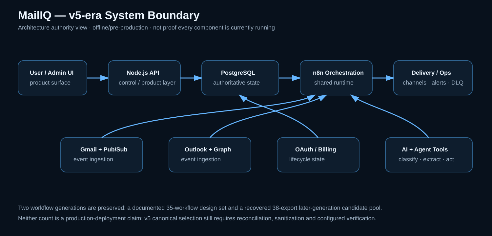
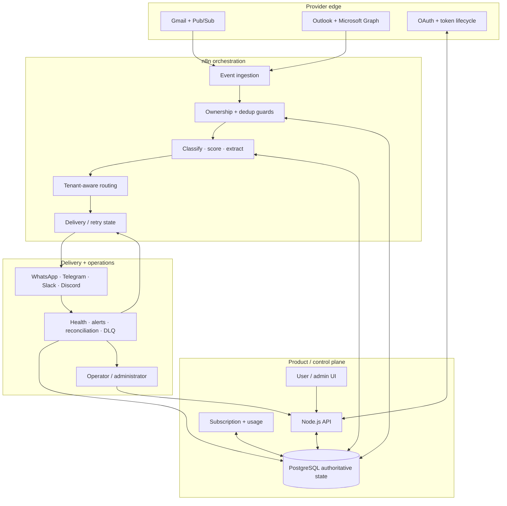

<p align="center">
  
</p>

<h1 align="center">MailIQ</h1>

<p align="center">Multi-tenant email intelligence for turning Gmail and Outlook activity into structured, tenant-aware operational signals.</p>

<p align="center"><strong>Offline Prototype</strong> · Previously trialled · Multi-version engineering archive · Not a live SaaS</p>

<p align="center">
  <a href="versions/README.md"><strong>Version Archive</strong></a> ·
  <a href="workflows/current-candidate/README.md"><strong>38-Workflow Candidate Bundle</strong></a> ·
  <a href="docs/MULTI_WORKFLOW_SYSTEM_MAP.md"><strong>System Map</strong></a>
</p>

---

## Table of contents

- [Current status](#current-status)
- [The problem](#the-problem)
- [The system response](#the-system-response)
- [Architecture boundary](#architecture-boundary)
- [Version history](#version-history)
- [Workflow generations](#workflow-generations)
- [Current 38-workflow subsystem structure](#current-38-workflow-subsystem-structure)
- [What is implemented or evidenced](#what-is-implemented-or-evidenced-across-the-archive)
- [Reliability findings](#reliability-findings-that-matter)
- [Evidence you can inspect](#evidence-you-can-inspect)
- [Public workflow policy](#public-workflow-policy)
- [Repository map](#repository-map)
- [Evidence boundary](#evidence-boundary)

### Version / architecture quick links

| Version / generation | Status | Version README | Architecture |
|---|---|---|---|
| v1.0 | Historical baseline | [open](versions/v1.0/README.md) | [diagram](versions/v1.0/ARCHITECTURE.md) |
| v1.1 | Historical workflow-heavy | [open](versions/v1.1/README.md) | [diagram](versions/v1.1/ARCHITECTURE.md) |
| v2.2 | Historical 36-workflow build | [open](versions/v2.2/README.md) | [diagram](versions/v2.2/ARCHITECTURE.md) |
| v3.0 | Historical state/infrastructure correction | [open](versions/v3.0/README.md) | [diagram](versions/v3.0/ARCHITECTURE.md) |
| v3.1 | Historical node-level expansion | [open](versions/v3.1/README.md) | [diagram](versions/v3.1/ARCHITECTURE.md) |
| v4.1 | Historical shared-workflow authority | [open](versions/v4.1/README.md) | [diagram](versions/v4.1/ARCHITECTURE.md) |
| v4.2 | Referenced; original not located | [open](versions/v4.2/README.md) | [known envelope](versions/v4.2/ARCHITECTURE.md) |
| v4.3 | Referenced; original not located | [open](versions/v4.3/README.md) | [known envelope](versions/v4.3/ARCHITECTURE.md) |
| Seat-isolation patch | Referenced patch | [open](versions/seat-isolation-patch/README.md) | [diagram](versions/seat-isolation-patch/ARCHITECTURE.md) |
| v5.0 | **Current architecture authority** | [open](versions/v5.0/README.md) | [diagram](versions/v5.0/ARCHITECTURE.md) |

The version folder also has its own self-rendering [`versions/README.md`](versions/README.md). Historical versions receive architecture diagrams; runtime screenshots/demos are only used when genuine evidence exists.

## Current status

MailIQ is a substantial historical/pre-production system with multiple surviving workflow and architecture generations. It was intended as a live SaaS, was previously trialled, and is currently offline while state-management, reliability, sanitization, and verification work are separated from historical design evidence.

This repository does **not** claim current paying customers, current public availability, production readiness, or a fully verified v5 runtime bundle.

<p align="center"></p>

## The problem

Important operational email competes with newsletters, receipts, alerts, and routine conversation inside the same inbox. Teams monitoring multiple Gmail and Outlook accounts repeatedly classify, prioritize, extract, route, and follow up on messages by hand. Urgent work can be missed, while routing knowledge remains trapped in individual inboxes.

## The system response

MailIQ was designed to convert incoming messages into structured intent, urgency, extracted details, and recommended actions, then route the result to a tenant-selected destination while keeping provider subscriptions, OAuth state, tenant configuration, delivery results, metering, billing, and reconciliation visible as system state.

## Architecture boundary



The diagram is an architecture model derived from inspected v5-era specifications and workflow evidence. It is not a claim that every component is currently deployed.

## Version history

Open [`versions/README.md`](versions/README.md) for the detailed lineage and cross-version decision arc. Every version/generation has a dedicated README and architecture page. Where an original standalone source was not recovered, the architecture page is explicitly labelled as an evidence-bounded reconstruction/envelope rather than a recovered original.

## Workflow generations

### Documented 35-workflow design set

One surviving primary-build generation contains **19 system workflows + 16 tenant delivery templates (35 total)** with a parsed node inventory of 676 nodes.

### Recovered later-generation pool

A later MailIQ archive contains **38 workflow exports** covering onboarding/plan flows, tier processors, billing, provider lifecycle handlers, notifications, usage, health/backup/admin operations, GDPR/history/DLQ functions, and conversational/tool workflows.

The 38-export set is the **candidate canonical pool for v5 reconciliation**, not automatically a verified current deployment. The 35-workflow set remains valuable design/evolution evidence but is no longer described as the uniquely authoritative v5 runtime bundle.

The sanitized public copies belong under [`workflows/current-candidate/`](workflows/current-candidate/README.md). Sanitization removes environment-bound credential bindings and private configuration; it does **not** promote a workflow to `CURRENT VERIFIED`.

See [the workflow catalog](docs/workflow-catalog.md) and [current visual sources](docs/architecture/current-visuals.md).

## Current 38-workflow subsystem structure

```text
workflows/current-candidate/
├── 01-onboarding/                 6 workflows
├── 02-tier-processors/            4 workflows
├── 03-billing-account-state/      5 workflows
├── 04-notifications-delivery/     6 workflows
├── 05-provider-lifecycle/         5 workflows
├── 06-reliability-compliance/     6 workflows
└── 07-agent-tools/                6 workflows
```

These are cooperating workflow families rather than one monolithic automation. Their shared state and calls are documented in the [multi-workflow system map](docs/MULTI_WORKFLOW_SYSTEM_MAP.md).

## What is implemented or evidenced across the archive

- Gmail and Outlook ingestion patterns
- Gmail Pub/Sub and Microsoft Graph receiver workflows
- AI classification, urgency scoring, extraction, and recommended-action logic
- tenant-aware delivery patterns across WhatsApp, Telegram, Slack, and Discord
- OAuth callbacks, token refresh, watch/subscription renewal patterns
- subscription lifecycle, usage metering, billing and reconciliation workflows
- health monitoring, administrative alerts, backup, purge/history and DLQ operations
- PostgreSQL state/ownership design
- onboarding/provisioning and factory-style workflow patterns
- later conversational-agent/tool workflows for calendar, email search, settings and draft/send actions

Evidence exists at different levels: workflow export, design specification, implementation documentation, audit finding, or historical operating note. A documented control is not automatically a verified runtime control.

## Reliability findings that matter

Historical inspection found state-reference failures where workflow steps could succeed while authoritative account state was written incorrectly, including identifier-name mismatches around credential and workflow references. That class of defect is why MailIQ is currently presented as offline/pre-production rather than as a live SaaS.

A credible relaunch requires controlled verification of provisioning/state references, onboarding/provider lifecycle, email ingestion/dedup/tenant isolation, delivery failure behavior, billing/usage/reconciliation, token refresh/renewal, observability/backup/DLQ, and release security/sanitization.

See [Reliability findings and rebuild plan](docs/reliability-and-rebuild.md).

## Evidence you can inspect

- [Version archive](versions/README.md)
- [Sanitized current-candidate workflow bundle](workflows/current-candidate/README.md)
- [Multi-workflow system map](docs/MULTI_WORKFLOW_SYSTEM_MAP.md)
- [Workflow catalog](docs/workflow-catalog.md)
- [Architecture](docs/architecture.md)
- [Architecture deep dive](docs/architecture/)
- [Evidence register](docs/evidence-register.md)
- [Database model](docs/database.md)
- [Integrations](docs/integrations.md)
- [Testing](docs/testing.md)
- [Security](docs/security.md) and [SECURITY.md](SECURITY.md)
- [Representative sanitized workflow](workflows/sanitized/SW-01_Onboarding_Factory_SANITIZED.json)
- [Historical architecture image](assets/historical-system-architecture-overview.png)

## Public workflow policy

The public candidate bundle may contain sanitized workflow JSON while still remaining unverified. A workflow is only promoted from candidate evidence to `CURRENT VERIFIED` after generation/source identification, secret and identifier sanitization, JSON parse/import validation, state/data-contract review, branch/expression inspection, and configured runtime verification for any behavior described as working.

## Repository map

```text
.
├── README.md                    Project overview + embedded table of contents
├── versions/
│   ├── README.md                v1.0 → v5.0 archive overview
│   └── <version>/
│       ├── README.md
│       └── ARCHITECTURE.md      Version-specific architecture diagram
├── assets/                      Logo + current/historical labelled visuals
├── docs/                        Architecture, data, testing, security, operations, evidence
├── workflows/
│   ├── current-candidate/       Sanitized 38-export candidate pool by subsystem
│   ├── sanitized/               Representative publishable workflow evidence
│   └── historical/              Historical import artifact(s)
├── evidence/current/            Current-only demo/screenshot evidence locations
├── SECURITY.md
└── CHANGELOG.md
```

## Historical/design stack

n8n · Node.js · PostgreSQL · Redis/Upstash · Gmail API · Microsoft Graph · Google/Microsoft OAuth 2.0 · Paystack · WhatsApp · Telegram · Slack · Discord · OpenAI/Groq integration designs · Railway/Docker deployment documentation.

## Evidence boundary

**Supported:** substantial multi-version email-intelligence architecture/workflow engineering; previously trialled; offline today; real workflow/specification/audit evidence.

**Not supported:** current live SaaS operation, paying customers, verified production uptime, a completely validated v5 bundle, or production-readiness claims.

---

Built by **Oyekola Ololade** as product-systems engineering evidence.  
For workflow architecture, reliability, integration, or repair work, use the portfolio linked from the GitHub profile.
