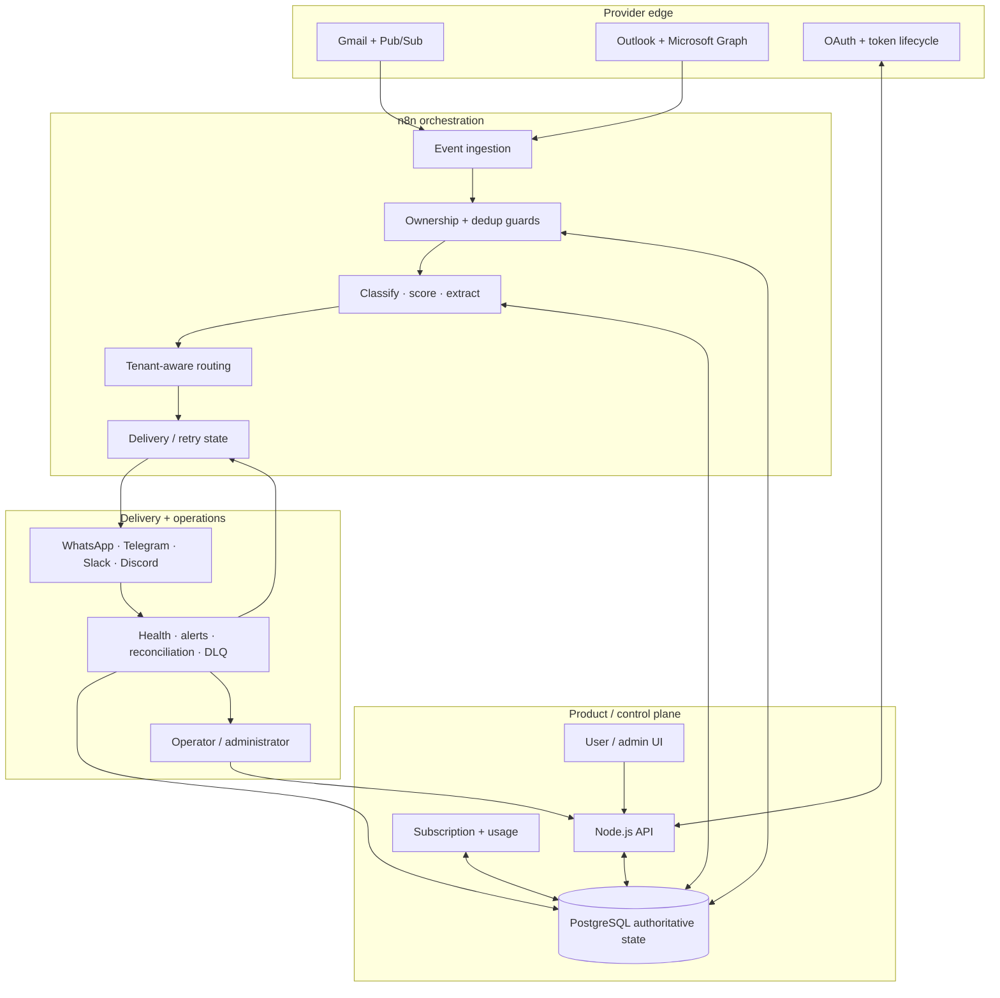

<p align="center">
  
</p>

<h1 align="center">MailIQ</h1>

<p align="center">Multi-tenant email intelligence for turning Gmail and Outlook activity into structured, tenant-aware operational signals.</p>

<p align="center"><strong>Offline Prototype</strong> · Previously trialled · Multi-version engineering archive · Not a live SaaS</p>

---

## Current status

MailIQ is a substantial historical/pre-production system with multiple surviving workflow and architecture generations. It was intended as a live SaaS, was previously trialled, and is currently offline while state-management, reliability, sanitization, and verification work are separated from historical design evidence.

This repository does **not** claim current paying customers, current public availability, production readiness, or a fully verified v5 runtime bundle.

## The problem

Important operational email competes with newsletters, receipts, alerts, and routine conversation inside the same inbox. Teams monitoring multiple Gmail and Outlook accounts repeatedly classify, prioritize, extract, route, and follow up on messages by hand. Urgent work can be missed, while routing knowledge remains trapped in individual inboxes.

## The system response

MailIQ was designed to convert incoming messages into structured intent, urgency, extracted details, and recommended actions, then route the result to a tenant-selected destination while keeping provider subscriptions, OAuth state, tenant configuration, delivery results, metering, billing, and reconciliation visible as system state.

## Architecture boundary



The diagram is an architecture model derived from inspected v5-era specifications and workflow evidence. It is not a claim that every component is currently deployed.

## Workflow generations

MailIQ has more than one legitimate workflow generation. That distinction matters.

### Documented 35-workflow design set

One surviving primary-build generation contains **19 system workflows + 16 tenant delivery templates (35 total)** with a parsed node inventory of 676 nodes.

### Recovered later-generation pool

A later MailIQ archive contains **38 workflow exports** covering onboarding/plan flows, tier processors, billing, provider lifecycle handlers, notifications, usage, health/backup/admin operations, GDPR/history/DLQ functions, and conversational/tool workflows.

The 38-export set is the **candidate canonical pool for v5 reconciliation**, not automatically a verified current deployment. The 35-workflow set remains valuable design/evolution evidence but is no longer described as the uniquely authoritative v5 runtime bundle.

See [the workflow catalog](docs/workflow-catalog.md) for the exact boundary.

## What is implemented or evidenced across the archive

- Gmail and Outlook ingestion patterns
- Gmail Pub/Sub and Microsoft Graph receiver workflows
- AI classification, urgency scoring, extraction, and recommended-action logic
- tenant-aware delivery patterns across WhatsApp, Telegram, Slack, and Discord
- OAuth callbacks, token refresh, watch/subscription renewal patterns
- subscription lifecycle, usage metering, billing and reconciliation workflows
- health monitoring, administrative alerts, backup, purge/history and DLQ operations
- PostgreSQL state/ownership design
- onboarding/provisioning and factory-style workflow patterns
- later conversational-agent/tool workflows for calendar, email search, settings and draft/send actions

Evidence exists at different levels: workflow export, design specification, implementation documentation, audit finding, or historical operating note. A documented control is not automatically a verified runtime control.

## Reliability findings that matter

Historical inspection found state-reference failures where workflow steps could succeed while authoritative account state was written incorrectly, including identifier-name mismatches around credential and workflow references. That class of defect is why MailIQ is currently presented as offline/pre-production rather than as a live SaaS.

A credible relaunch requires controlled verification of:

1. provisioning and authoritative state references;
2. onboarding and provider subscription lifecycle;
3. email ingestion, deduplication and tenant isolation;
4. delivery retry/failure behavior;
5. billing, usage and reconciliation;
6. token refresh/renewal behavior;
7. observability, backup and DLQ recovery;
8. security and release sanitization.

See [Reliability findings and rebuild plan](docs/reliability-and-rebuild.md).

## Evidence you can inspect

- [Workflow catalog](docs/workflow-catalog.md) — current-vs-historical generation boundary.
- [Architecture](docs/architecture.md) — control plane, runtime, delivery and feedback loops.
- [Architecture deep dive](docs/architecture/) — system and workflow architecture notes.
- [Evidence register](docs/evidence-register.md) — what the archive supports and what remains private.
- [Database model](docs/database.md) — state and ownership design.
- [Integrations](docs/integrations.md) — provider/integration boundaries.
- [Testing](docs/testing.md) — verification requirements and historical evidence boundary.
- [Security](docs/security.md) and [SECURITY.md](SECURITY.md) — publication and operational security notes.
- [Representative sanitized workflow](workflows/sanitized/SW-01_Onboarding_Factory_SANITIZED.json).
- [Historical architecture image](assets/historical-system-architecture-overview.png) — retained as historical context only.

## Public workflow policy

The private archive contains substantially more workflow material than this repository. Public release is intentionally selective.

Before any workflow is added to a future `workflows/current/` bundle it must pass:

- generation/source identification;
- secret and identifier sanitization;
- JSON parse/import validation;
- state/data-contract review;
- branch/expression inspection;
- configured runtime verification for any behavior described as working.

## Repository map

```text
.
├── assets/                      Logo + labelled historical visual evidence
├── docs/                        Architecture, data, testing, security, operations, evidence
├── workflows/
│   ├── sanitized/               Publishable representative workflow evidence
│   └── historical/              Historical import artifact(s)
├── SECURITY.md
└── README.md
```

## Historical/design stack

n8n · Node.js · PostgreSQL · Redis/Upstash · Gmail API · Microsoft Graph · Google/Microsoft OAuth 2.0 · Paystack · WhatsApp · Telegram · Slack · Discord · OpenAI/Groq integration designs · Railway/Docker deployment documentation.

## Evidence boundary

**Supported:** substantial multi-version email-intelligence architecture/workflow engineering; previously trialled; offline today; real workflow/specification/audit evidence.

**Not supported:** current live SaaS operation, paying customers, verified production uptime, a completely validated v5 bundle, or production-readiness claims.

---

Built by **Oyekola Ololade** as product-systems engineering evidence.  
For workflow architecture, reliability, integration, or repair work, use the portfolio linked from the GitHub profile.
