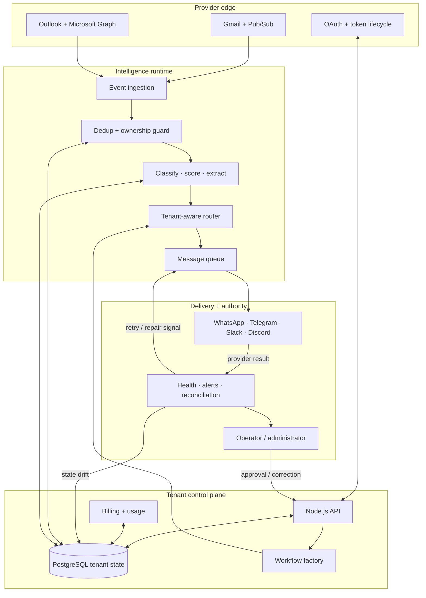

<p align="center">
  
</p>

<h1 align="center">MailIQ</h1>

<p align="center">
  Multi-tenant email intelligence that converts Gmail and Outlook activity into structured, tenant-aware operational signals.
</p>

<p align="center">
  <strong>Offline Prototype</strong> · Previously trialled · Evidence-backed · Not a live SaaS
</p>

---

## The problem

Important work competes with newsletters, receipts, alerts, and routine conversation inside the same inbox. Teams monitoring multiple Gmail and Outlook accounts must repeatedly read, classify, prioritize, and forward messages by hand. Urgent action can be missed, while routing knowledge remains trapped in individual inboxes.

## The system response

MailIQ was designed to turn each incoming message into structured intent, urgency, extracted details, and a recommended action—then route that result to the communication channel selected for that tenant.

This repository now exposes the real engineering evidence behind that idea: a 35-workflow canonical design, representative sanitized n8n exports, a multi-tenant data model, provider lifecycle design, reliability findings, and the production boundary.

| Evidence signal | Verified from the Drive archive |
|---|---:|
| Canonical system workflows | 19 |
| Canonical tenant templates | 16 |
| Canonical workflow nodes | 676 |
| Older architecture exports | 38 |
| Older architecture nodes | 498 |
| JSON artifacts inspected | 76 |
| Total Drive artifacts inspected | 115 |

> Counts describe inspected design and workflow artifacts. They do not mean that all workflows are deployed or production-verified.

## Architecture

MailIQ is not a one-way “email in, message out” automation. Provider subscriptions, OAuth state, tenant configuration, delivery results, metering, and reconciliation all send information back into orchestration.



The diagram is a current architecture model derived from the inspected v5 specification and workflow evidence—not a claim that every component is presently running.

## Evidence you can inspect

- [Canonical workflow catalog](docs/workflow-catalog.md) — all 35 workflows, roles, and node counts.
- [Architecture and state loops](docs/architecture.md) — control plane, runtime, delivery, and feedback paths.
- [Evidence register](docs/evidence-register.md) — what was found in Drive, what is public here, and what remains private.
- [Reliability findings](docs/reliability-and-rebuild.md) — verified defects, design decisions, and the next production scope.
- [Sanitized workflow evidence](workflows/README.md) — representative n8n exports with credentials removed.
- [Historical architecture image](assets/historical-system-architecture-overview.png) — retained as historical context, not the current source of truth.

## Engineering decisions

| Decision | Why it matters |
|---|---|
| Shared templates + tenant context | Avoids manually maintaining a completely separate design for every account while preserving tenant ownership. |
| Database-backed token state | Prevents long-running workflow memory from becoming the authority for OAuth credentials. |
| Exactly-one-owner constraints | Records that belong to either a client or a team member must never silently belong to both—or neither. |
| Insert-on-conflict idempotency | Avoids race-prone “check, then insert” behavior for events and queues. |
| Unified message queue | Reduces the risk of double sending across separate digest and pending-message stores. |
| Refresh-token rotation | Makes token reuse detectable and provides a clear forced-login response. |
| Reconciliation as a first-class loop | Treats provider drift, billing drift, and delivery failures as normal operational states. |
| Deferred queue mode | Keeps pre-revenue infrastructure simpler until load and backlog justify the additional cost. |

## What is implemented or evidenced

- Gmail and Outlook ingestion workflows
- Gmail Pub/Sub and Microsoft Graph receiver patterns
- AI classification, urgency scoring, extraction, and recommended-action logic
- Tenant-aware template routing across WhatsApp, Telegram, Slack, and Discord
- OAuth callback, refresh, watch-renewal, and subscription-renewal designs
- Subscription, usage-metering, and reconciliation workflows
- Health monitoring, administrative alerting, and backup workflows
- PostgreSQL schema and ownership constraints
- Factory-style onboarding and workflow provisioning logic

Evidence exists at different levels: exported workflow, implementation documentation, architecture specification, or operating-history note. A documented control is not automatically a verified runtime control.

## Production boundary

MailIQ was previously trialled and is currently offline. No paying customers, current availability, or production readiness are claimed.

A credible relaunch requires:

1. Repairing and testing provisioning state references.
2. Running critical onboarding, ingestion, delivery, billing, and failure paths with controlled credentials.
3. Verifying idempotency, retries, deduplication, circuit breaking, and queue behavior under failure.
4. Completing metering, reconciliation, observability, and tenant-isolation tests.
5. Recording sustained operating evidence separately from design evidence.

See [Reliability findings and rebuild plan](docs/reliability-and-rebuild.md) for the exact boundary.

## Repository map

```text
.
├── assets/                     Official identity + labelled historical diagram
├── docs/                       Architecture, evidence, security, operations, and decisions
├── workflows/
│   ├── sanitized/              Publishable representative workflow
│   └── historical/             Older import artifact with placeholder configuration
└── README.md                   Buyer-first technical overview
```

The previous one-byte files under `src/` were removed because they implied implementation where there was none. The repository now distinguishes real workflow evidence from documentation and future rebuild work.

## Safe workflow inspection

The public workflow files use placeholders or redacted credential references. Before importing them:

- inspect every node and expression;
- create fresh credentials in your own n8n instance;
- replace placeholder URLs, IDs, and channel destinations;
- keep the workflows inactive until tests pass;
- use synthetic email and billing data;
- never commit exported credentials or real customer content.

## Historical/design stack

n8n · Node.js · PostgreSQL · Redis/Upstash · Gmail API · Microsoft Graph · Google/Microsoft OAuth 2.0 · Paystack · WhatsApp · Telegram · Slack · Discord · OpenAI/Groq integration designs · Railway/Docker deployment documentation.

---

Built by **Oyekola Ololade** as product systems engineering evidence.  
For similar workflow architecture, reliability, or integration work, open the portfolio linked from the GitHub profile.
