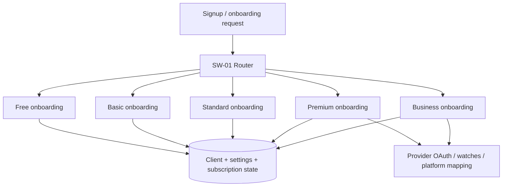
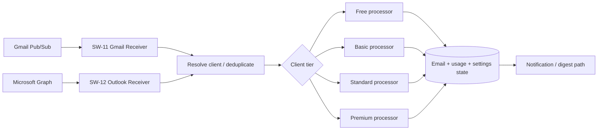
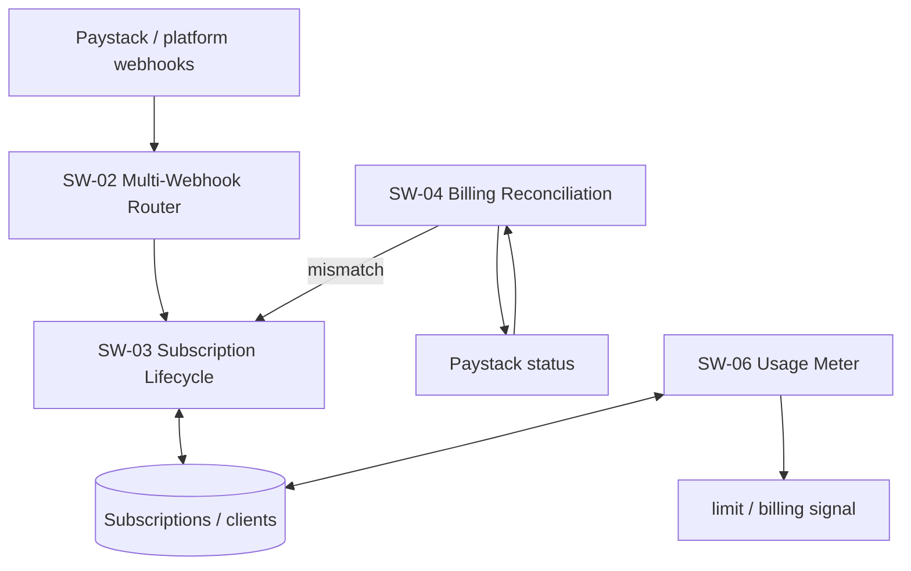
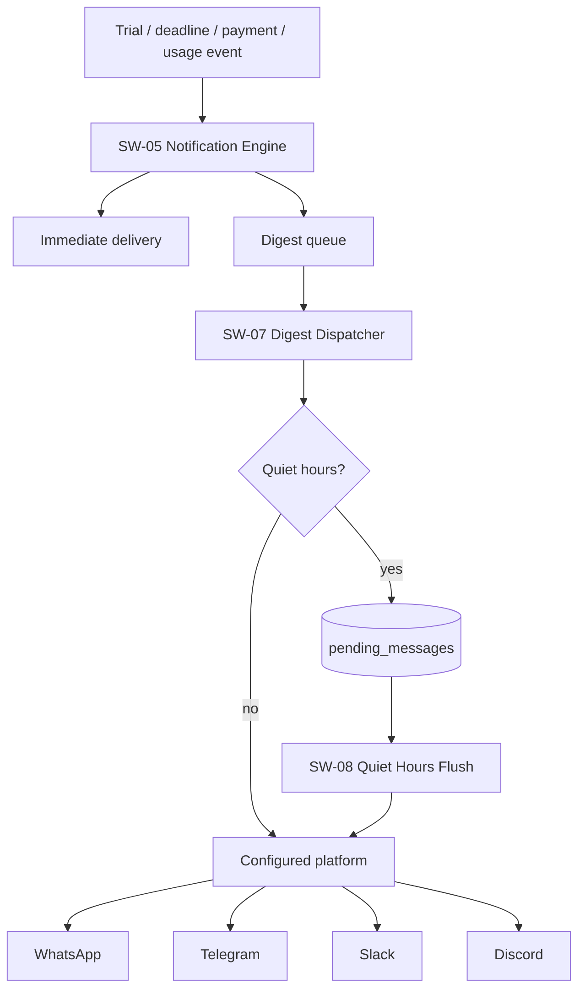
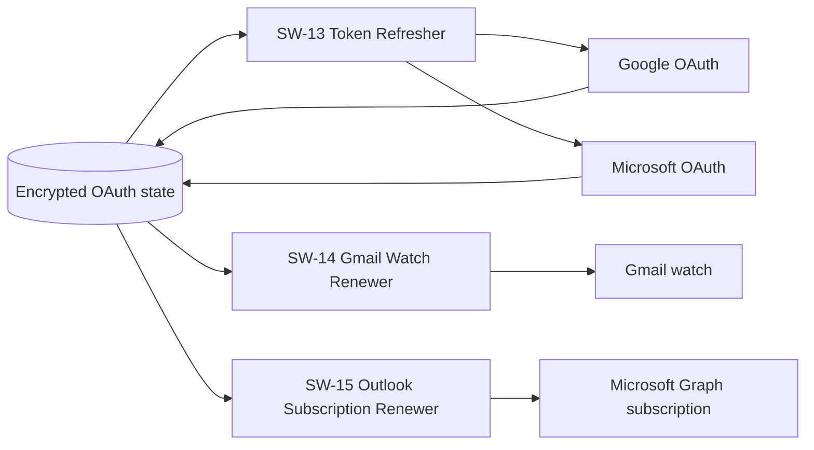
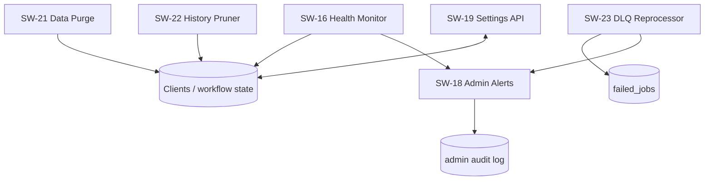
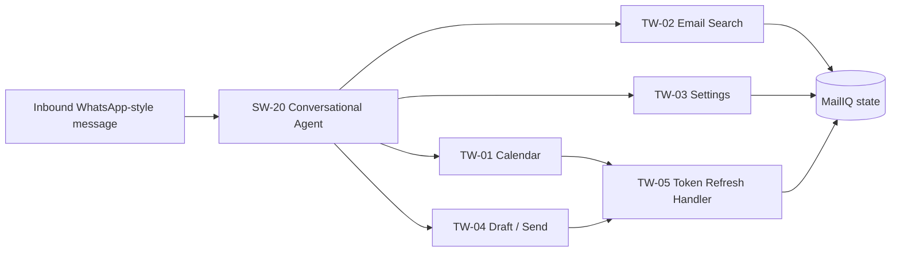

# MailIQ Multi-Workflow System Map

## Status

**Recovered later-generation architecture / static implementation evidence. Runtime revalidation pending.**

MailIQ is not one n8n workflow. The later build is a cooperating set of onboarding, email-processing, provider-lifecycle, billing, notification, operational and agent-tool workflows sharing authoritative PostgreSQL state.

## 1. Onboarding and tenant creation

The router and plan-specific onboarding workflows are separate because plan capabilities, provider setup and platform configuration differ.

## 2. Email-event processing

A separate Business processor export was **not recovered** in the later 38-file set. Business onboarding exists. No missing processor is invented in this repository.

## 3. Billing and usage control

Billing state is intended to gate processing rather than exist as a disconnected accounting afterthought.

## 4. Notifications and platform delivery

Telegram and Slack have separate onboarding/mapping workflows; Discord has a bot-join mapping handler.

## 5. Provider lifecycle

This family exists because push subscriptions and access tokens expire independently of email-processing logic.

## 6. Operations and recovery

## 7. Conversational agent and tools

## Architecture principle

The core design is **shared workflows + per-client state**, not one complete n8n clone per customer. PostgreSQL is the intended authority for client, subscription, integration, OAuth, usage, notification and operational state.

That principle is also why historical identifier/state mismatches are serious: a workflow can visibly execute while authoritative state is wrong.
