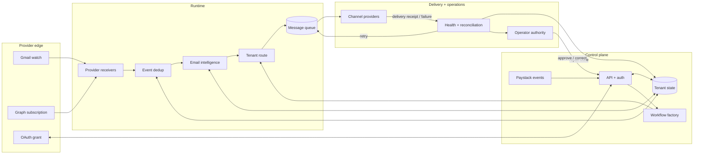
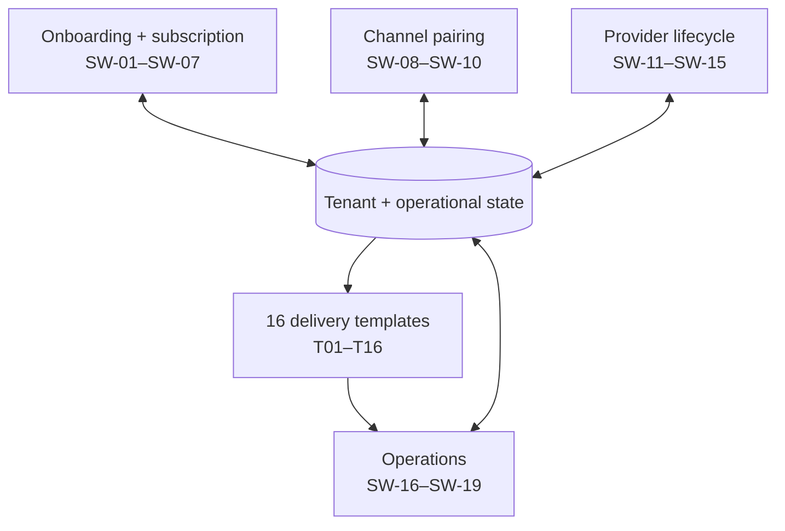
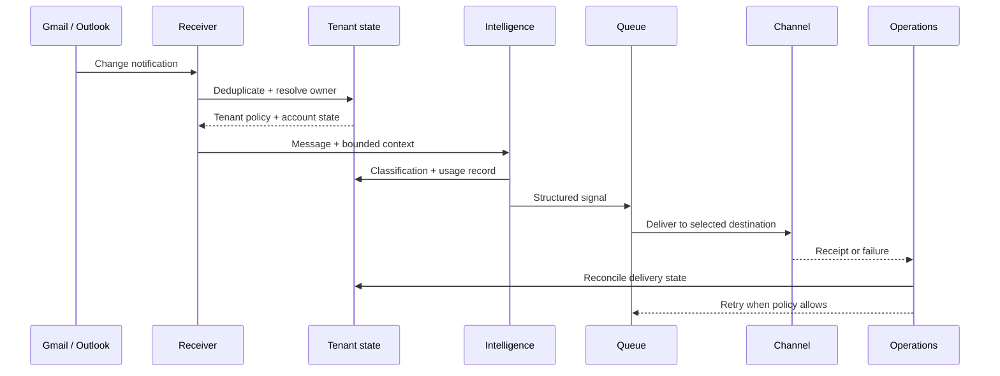
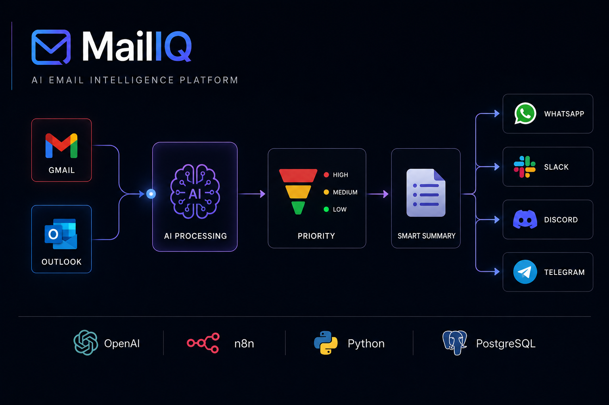

# MailIQ architecture

## Status and scope

This document represents the current architecture model recovered from the MailIQ v5 specification, the 35-workflow canonical set, earlier exports, and the logic audit. MailIQ is offline; the model explains system intent and inspected evidence, not a running production deployment.

## Four interacting planes

| Plane | Responsibilities | Primary state |
|---|---|---|
| Provider edge | Gmail/Outlook events, OAuth grants, watches, Graph subscriptions | Provider event IDs, cursors, expiry, subscription state |
| Tenant control | Identity, account ownership, configuration, provisioning, billing | Clients, team members, OAuth tokens, platform mappings, subscriptions |
| Intelligence runtime | Ingest, deduplicate, classify, score, extract, route, queue | Email log, tenant policy, AI output, message queue |
| Operations | Delivery results, usage, reconciliation, health, alerts, backup | Failed jobs, webhook events, reconciliation logs, usage ledger |

## Data and control flow

## Why several arrows run both ways

- **OAuth:** the application initiates consent; providers return grants, expiry, revocation, and refresh results.
- **Subscriptions:** MailIQ creates watches/subscriptions; Gmail and Microsoft return lifecycle state and later event notifications.
- **Tenant state:** runtime reads ownership and policy, then writes processing, usage, and failure outcomes back.
- **Delivery:** MailIQ submits a signal; the channel provider returns success, failure, or retry information.
- **Reconciliation:** drift is detected after the main path and fed back into queue, billing, token, or tenant state.
- **Human authority:** an operator can resolve provider pairing, billing, credential, or repeated-failure states that should not be “fixed” autonomously.

## Canonical workflow topology

The canonical set contains 19 system workflows and 16 delivery templates. See [workflow-catalog.md](workflow-catalog.md) for every workflow and node count.

## Persistence rules recovered from v5

- OAuth and platform tokens are designed for encrypted-at-rest storage.
- Runtime executions should read token state directly from PostgreSQL; workflow static data must not become the token authority.
- Inserts for events and queue state should use conflict-aware idempotency, not a select-then-insert race.
- Records supporting either a client or a team member use an exactly-one-owner constraint.
- The unified message queue replaces separate pending/digest queues to reduce double-send risk.
- Webhook events also provide a reconciliation cursor through processed/unprocessed state.
- Refresh tokens are rotated; reuse of an already-used token is intended to revoke the chain and force login.

## Representative email-processing path

## Infrastructure decisions

The current specification describes a Node.js API, PostgreSQL, n8n orchestration, and Redis/Upstash for bounded application concerns such as OTPs, rate limiting, and revoked-token entries. n8n queue mode is explicitly deferred until memory pressure or execution backlog justifies its additional infrastructure cost.

## Historical architecture image

This image was retained from Drive as historical evidence. When it conflicts with this document or the v5 source, the v5 model and the repository evidence register take precedence.
