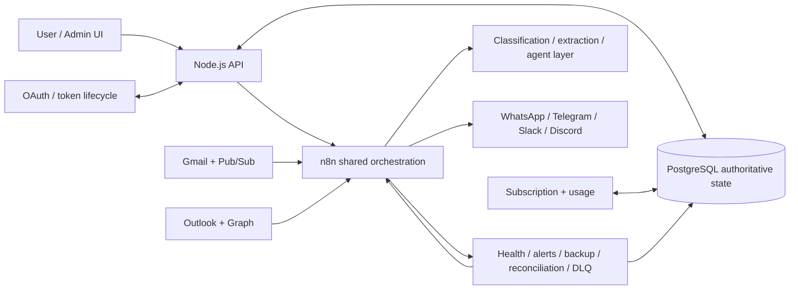
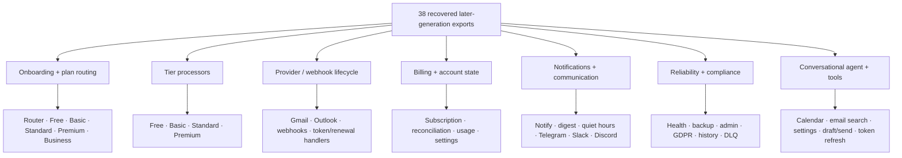
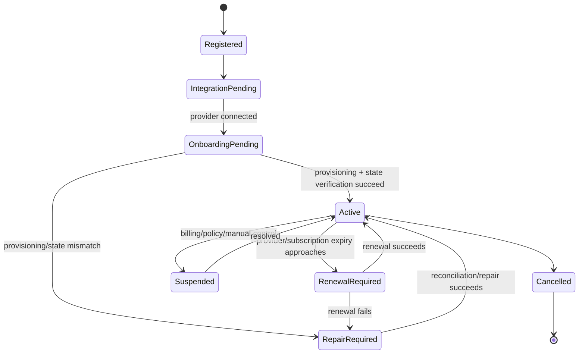

# MailIQ Current Visual Sources

These diagrams are maintained as text so GitHub can render them directly and future architecture changes can be reviewed as diffs.

## v5-era system boundary

**Boundary:** architecture authority, not proof that every component is currently running.

## Recovered later-generation workflow topology

**Boundary:** candidate canonical pool for v5 reconciliation. It does not mean 38 final, enabled, production-verified workflows.

## Account-state lifecycle

The state diagram is a control model. Exact runtime transitions must be verified against the selected workflow generation before a relaunch.
