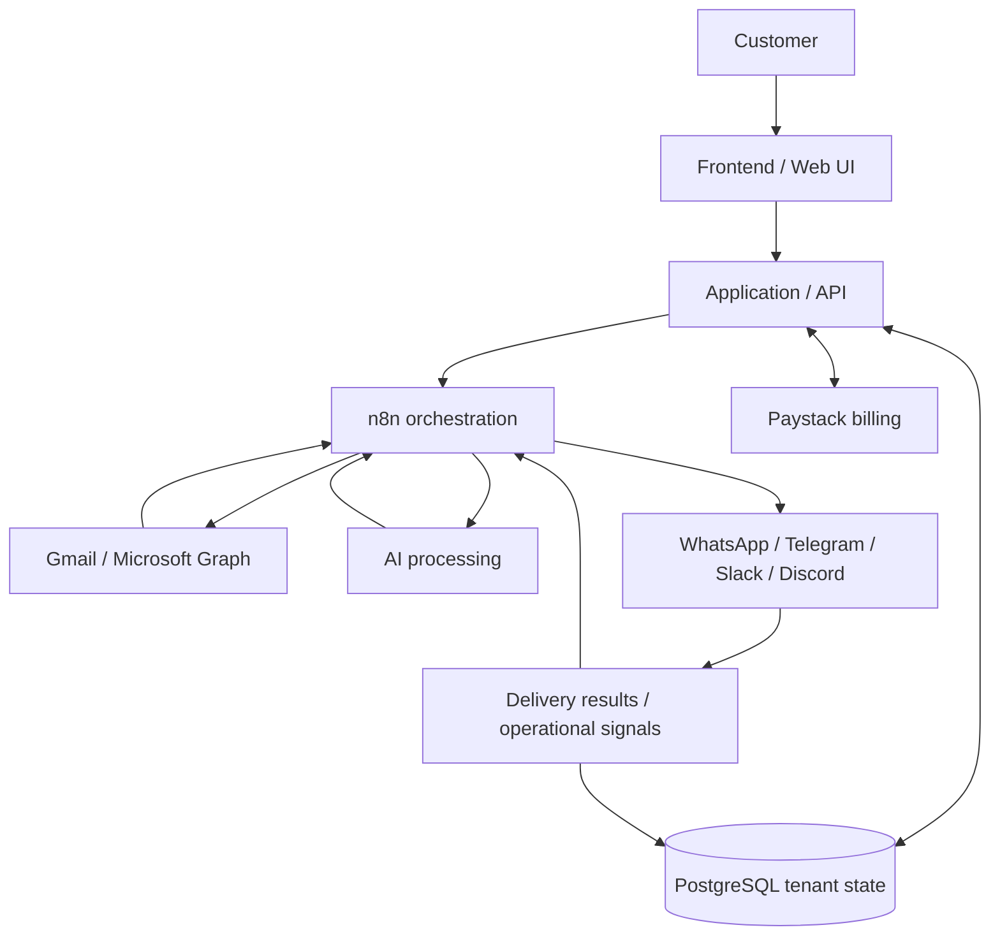

# MailIQ Deployment & Infrastructure

> **Evidence status:** Historical deployment architecture and relaunch design. MailIQ is currently offline and this document does not claim a current production deployment.

## 1. Overview

MailIQ was previously deployed as a distributed SaaS prototype using application hosting, n8n orchestration, authentication providers, external integrations, and supporting services. It had trial users while online, but it is not currently hosted and no paying-customer or production-readiness claim is made.

This document records the infrastructure used or designed for that system and the intended relaunch boundary.

The architecture was designed to support:

- workflow execution;
- customer provisioning;
- external API integrations;
- OAuth authentication;
- AI processing;
- multi-channel delivery;
- subscription billing;
- operational monitoring; and
- containerised services.

Whether an individual capability was fully verified at runtime is documented separately in the repository evidence and reliability material.

---

## 2. Infrastructure Overview

| Component | Historical / intended responsibility |
|---|---|
| Railway | Application and workflow hosting |
| n8n | Workflow orchestration |
| Docker | Containerisation |
| Netlify / Vercel | Frontend hosting |
| Google Cloud | Google OAuth configuration |
| Microsoft Azure | Microsoft application registration |
| Evolution API | WhatsApp connectivity |
| Groq / OpenAI-compatible models | AI processing used or explored across iterations |
| PostgreSQL | Persistent application state |
| Paystack | Subscription and trial billing flows |

The system separates application hosting, workflow execution, authentication, AI processing, communication services, billing, and persistent state so that each boundary can be tested independently.

---

## 3. Historical / Intended Deployment Architecture

This diagram is an architecture record, not evidence that every component is currently deployed or that every integration passed sustained production testing.

---

## 4. Current Status

MailIQ is **offline**. The public repository should be treated as engineering evidence for the product architecture, workflow design, sanitized implementation artifacts, and known reliability work.

Before a credible relaunch, the system still needs configured end-to-end verification of the critical paths documented in [reliability-and-rebuild.md](./reliability-and-rebuild.md), including provisioning state, tenant isolation, idempotency, retries, failure handling, billing state, reconciliation, and observability.

## 5. Evidence Boundary

This document does **not** claim:

- a current live deployment;
- production-ready reliability or security;
- all 35 workflows running together in one verified environment;
- paying customers;
- uptime, SLA, throughput, or business-outcome guarantees.

For the repository-wide evidence boundary, see [evidence-register.md](./evidence-register.md) and the main [README](../README.md).
