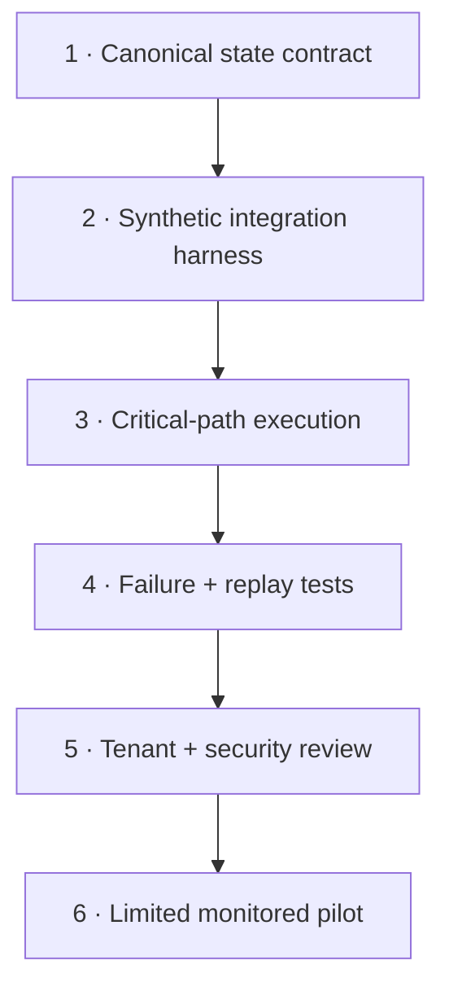

# Reliability findings and rebuild plan

## Why this document exists

MailIQ has substantial implementation and design evidence, but a prototype can still fail at the seams between credentials, tenant state, workflow creation, delivery, and billing. This document makes those seams visible.

## Verified logic findings

### 1. Provisioning reference mismatch

The onboarding workflow captures a created credential as `credential_id`, while a later account-update path reads `integration_credential_id`.

**Risk:** a successful provider credential can be created but not persisted into the account field expected downstream.

**Repair:** define one typed provisioning-state contract, validate it after every external creation step, and block activation until the credential reference is persisted and reread.

### 2. Workflow reference mismatch

Workflow creation captures `workflow_id`, while a later update path reads `automation_id`.

**Risk:** the workflow can exist in n8n while tenant state lacks the reference required for lifecycle management.

**Repair:** normalize the returned n8n workflow object, persist one canonical field, reread it transactionally, then activate.

### 3. Activation can outrun persistence

The inspected factory path can progress toward active state even when credential/workflow references are incomplete.

**Risk:** the account appears provisioned while its executable path is broken.

**Repair:** model provisioning as explicit states—`pending`, `credentials_ready`, `workflow_created`, `verified`, `active`, `failed`—with compensating cleanup.

### 4. Idempotency ordering

An earlier processing design checked a message identifier before the provider fetch that produces that identifier.

**Risk:** the supposed duplicate guard cannot reliably guard the actual message.

**Repair:** receive provider cursor/event → fetch changed message IDs → insert each ID with `ON CONFLICT` → process only newly inserted records.

### 5. Provider and channel mismatch risk

The audit records integration/provider mismatches, including WhatsApp-path inconsistencies.

**Risk:** a correctly classified message can still be sent through the wrong adapter or malformed provider contract.

**Repair:** make adapters explicit, schema-validate their inputs, and run contract tests against provider sandboxes or mocks.

## Production boundary by subsystem

| Subsystem | Evidence today | Required before relaunch |
|---|---|---|
| Ingestion | Gmail/Outlook receiver and lifecycle workflows | Controlled watch/subscription tests, renewal tests, event replay |
| Intelligence | Classification/extraction workflow evidence | Output-schema validation, fallback behavior, adversarial email tests |
| Tenant isolation | Schema and ownership design | Query-level authorization and cross-tenant tests |
| Provisioning | Factory workflow and template matrix | Repair state references, compensating actions, full-path test |
| Delivery | Four-channel routing templates | Provider contract tests, receipts, retry limits, dead-letter behavior |
| Billing | Paystack and usage/reconciliation workflows | Signed webhook tests, ordering tests, ledger reconciliation |
| Reliability | Health, alert, retry, and reconciliation designs | Fault injection, idempotency proof, circuit-breaker verification |
| Security | OAuth/JWT/token-storage design | Key rotation, secrets management, threat model, security review |
| Operations | Backup and admin workflow designs | Restore drill, dashboards, alerts, runbooks, ownership |

## Rebuild sequence

### Phase 1 — canonical contracts

- freeze canonical field names for tenant, credential, workflow, subscription, provider cursor, and delivery state;
- add JSON schemas or TypeScript contracts at every workflow boundary;
- create database constraints for impossible ownership and lifecycle states.

### Phase 2 — synthetic harness

- use test inboxes and synthetic messages;
- mock channel delivery before any real destination;
- record provider callbacks and replay them deterministically;
- keep billing in test mode.

### Phase 3 — critical paths

Test at minimum:

- first Gmail account and first Outlook account;
- every delivery channel;
- token refresh and revoked grant;
- duplicate provider event;
- workflow creation failure after credential creation;
- delivery timeout and provider rejection;
- late/out-of-order billing webhook;
- account pause, reconnect, and removal.

### Phase 4 — operational proof

- measure processing and delivery latency;
- reconcile provider events against internal logs;
- verify retry ceilings and dead-letter handling;
- perform backup restore;
- document every manual intervention point.

## Definition of credible “live”

MailIQ should only be called live when the selected deployment has configured credentials, passed the critical-path and failure-path tests above, has active monitoring and reconciliation, and has recorded operating evidence over a defined observation period.
