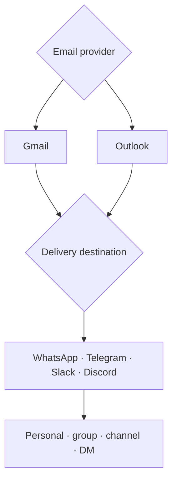

# Canonical workflow catalog

## Count boundary

The canonical v5 set contains **35 workflows and 676 nodes**:

- 19 system workflows / 204 nodes
- 16 child delivery templates / 472 nodes

A separate older MailIQ folder contains 38 exports / 498 nodes. Those older exports are useful evolution evidence but are not added to the canonical count.

Node totals were calculated by parsing all 76 JSON artifacts found in Drive. Every JSON artifact parsed successfully.

## System workflows

| ID | Workflow | Nodes | Responsibility |
|---|---|---:|---|
| SW-01 | Onboarding Factory | 24 | Provisions tenant-scoped workflow state from a reusable template. |
| SW-02 | Paystack Webhook Handler | 11 | Receives and normalizes billing events. |
| SW-03 | Subscription Lifecycle | 17 | Applies subscription state transitions. |
| SW-04 | Billing Reconciliation | 9 | Reconciles provider events with internal billing state. |
| SW-05 | Payment Retry / Reminder | 8 | Coordinates bounded payment follow-up. |
| SW-06 | Usage Meter | 17 | Records usage signals for billing and operations. |
| SW-07 | Usage Reconciliation | 8 | Checks usage records against processing state. |
| SW-08 | Telegram Chat ID Capture | 8 | Pairs a Telegram destination with tenant context. |
| SW-09 | Slack OAuth Callback | 8 | Completes Slack workspace authorization. |
| SW-10 | Discord Bot Join Handler | 8 | Captures Discord delivery context. |
| SW-11 | Gmail Pub/Sub Receiver | 10 | Receives Gmail change notifications. |
| SW-12 | Outlook Graph Receiver | 12 | Receives Microsoft Graph change notifications. |
| SW-13 | Token Refresher | 11 | Refreshes provider tokens before expiry. |
| SW-14 | Gmail Watch Renewer | 8 | Renews Gmail watch registrations. |
| SW-15 | Outlook Subscription Renewer | 9 | Renews Microsoft Graph subscriptions. |
| SW-16 | Health Monitor | 11 | Inspects workflow and integration health. |
| SW-17 | Database Backup | 9 | Coordinates scheduled persistence backups. |
| SW-18 | Admin Alerts | 5 | Routes operational exceptions to an administrator. |
| SW-19 | Settings API | 11 | Reads and writes tenant configuration. |

## Tenant delivery templates

The first eight Gmail templates contain 30 nodes each. The eight Outlook templates contain 29 nodes each.

| ID | Provider → destination | Nodes |
|---|---|---:|
| T01 | Gmail → WhatsApp | 30 |
| T02 | Gmail → Telegram Personal | 30 |
| T03 | Gmail → Telegram Group | 30 |
| T04 | Gmail → Telegram Channel | 30 |
| T05 | Gmail → Slack Channel | 30 |
| T06 | Gmail → Slack DM | 30 |
| T07 | Gmail → Discord Channel | 30 |
| T08 | Gmail → Discord DM | 30 |
| T09 | Outlook → WhatsApp | 29 |
| T10 | Outlook → Telegram Personal | 29 |
| T11 | Outlook → Telegram Group | 29 |
| T12 | Outlook → Telegram Channel | 29 |
| T13 | Outlook → Slack Channel | 29 |
| T14 | Outlook → Slack DM | 29 |
| T15 | Outlook → Discord Channel | 29 |
| T16 | Outlook → Discord DM | 29 |

## Template dimensions

The templates combine provider-specific ingestion with channel-specific delivery. They are not 16 unrelated products; they are a reusable matrix of tenant execution paths.

## Published exports

Only representative, sanitized files are included in the public repository:

- `workflows/sanitized/SW-01_Onboarding_Factory_SANITIZED.json`
- `workflows/historical/MailIQ_n8n_import_fixed.json`

The remaining Drive exports stay private until each file receives a dedicated release review. A secret-pattern scan found no obvious live secret strings in the 76 JSON files, but that automated result is not sufficient authorization to publish all exports.
