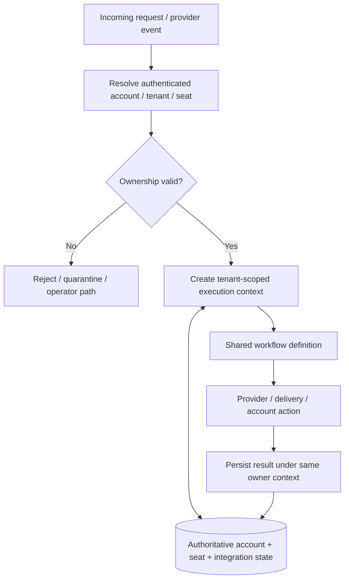

# MailIQ — Seat-Isolation Patch Architecture

[← Patch README](README.md) · [Version Index](../INDEX.md)

> **Status:** REFERENCED PATCH — ORIGINAL PATCH TEXT NOT LOCATED. The visual focuses only on the purpose supported by the archive: making tenant/account/seat ownership explicit and preventing ambiguous or cross-tenant state use.

## Supported architectural purpose

- explicit tenant/account/seat ownership resolution;
- scoped execution context before shared workflow actions;
- state writes tied back to the same authoritative owner boundary.

Exact historical SQL, node edits and migration statements are not invented because the standalone patch source was not recovered.
