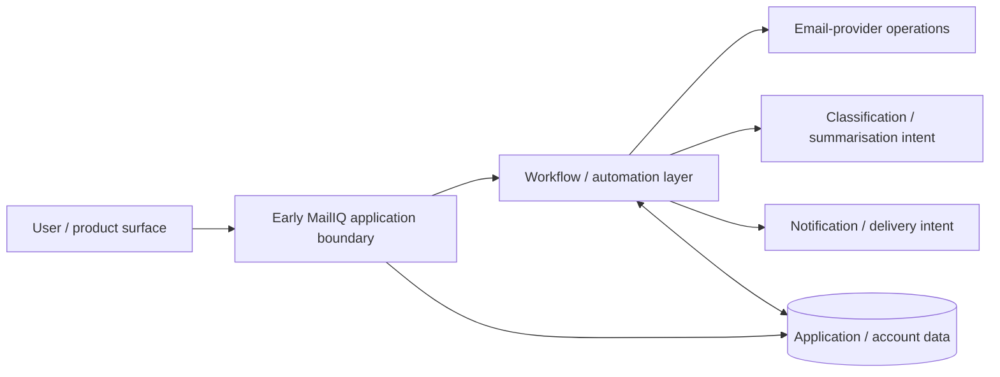

# MailIQ v1.0 — Architecture Diagram

[← v1.0 README](README.md) · [Version Index](../INDEX.md)

> **Status:** HISTORICAL BASELINE. This is an explanatory architecture diagram derived from the surviving v1.0 architecture record. It is not a claim that a complete v1.0 runtime bundle survives.

## What the diagram is meant to show

v1.0 is the baseline product/system definition. The exact later separation between Node.js/API responsibilities, PostgreSQL OAuth authority, shared workflow definitions and hardened operational workflows had not yet matured into the later architecture.

## Evidence boundary

- **Supported:** the baseline application + workflow + email-intelligence product architecture existed.
- **Not supported:** a recovered complete v1.0 workflow JSON set, current deployment, or later v5 controls being present in this exact form.
