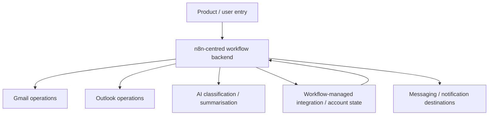

# MailIQ v1.1 — Architecture Diagram

[← v1.1 README](README.md) · [Version Index](../INDEX.md)

> **Status:** HISTORICAL. v1.1 represents the workflow-heavy / mostly-all-n8n direction recorded in the surviving architecture evidence.

## Architectural meaning

This generation shifted more application behavior into n8n. Later versions deliberately restored a clearer API/application boundary and moved authoritative provider/OAuth state away from dynamic workflow credentials toward PostgreSQL-backed state.

## Evidence boundary

The diagram represents the documented direction of v1.1. It does not claim that every later workflow export belongs to this version or that this topology is current.
