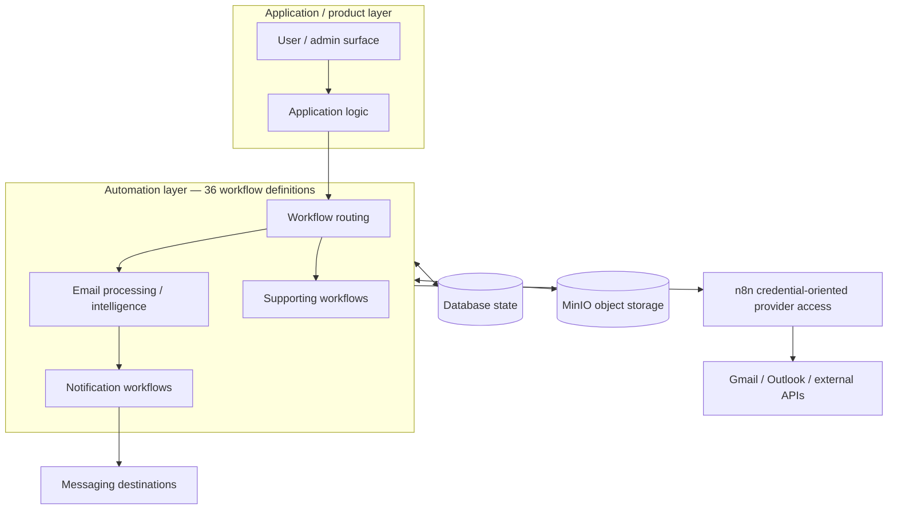

# MailIQ v2.2 — Architecture Diagram

[← v2.2 README](README.md) · [Version Index](../INDEX.md)

> **Status:** HISTORICAL COMPLETE-BUILD GENERATION. The surviving v2.2 specification is associated with **36 workflow definitions**, n8n credential-oriented provider access and MinIO.

## Why this version is distinct

The **36-workflow** count belongs to this generation. It must not be merged with the later 35-workflow design set or the later 38-export candidate pool.

## Later corrections

- provider OAuth/token authority moved toward PostgreSQL;
- per-client/dynamic workflow assumptions were replaced by shared workflow definitions + tenant-scoped execution;
- MinIO was removed from the current v5 default architecture.
