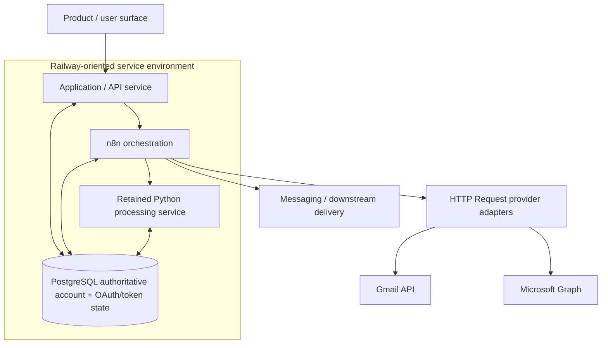

# MailIQ v3.0 — Architecture Diagram

[← v3.0 README](README.md) · [Version Index](../INDEX.md)

> **Status:** HISTORICAL STATE / INFRASTRUCTURE CORRECTION.

## Architectural correction

v3.0 moves provider OAuth/token state into PostgreSQL-backed authoritative state and uses provider APIs through workflow HTTP Request patterns rather than treating dynamic n8n credentials as the primary tenancy mechanism.

## Evidence boundary

This diagram represents the surviving v3.0 architectural direction. It does not claim a complete public v3.0 workflow bundle or a currently deployed Railway environment.
