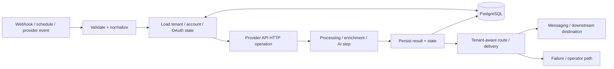

# MailIQ v3.1 — Architecture Diagram

[← v3.1 README](README.md) · [Version Index](../INDEX.md)

> **Status:** HISTORICAL NODE-LEVEL BUILD EXPANSION. v3.1 is the detailed historical fallback for workflow/backend implementation intent where later sources are less granular.

## Architectural meaning

This is an implementation-detail view of the v3 state model: workflow nodes increasingly consume authoritative database/application state rather than making credential objects the source of truth.

## Supersession

When a v3.1 detail conflicts with v4.1 or v5.0, later authority wins. This diagram is historical implementation intent, not current runtime authority.
