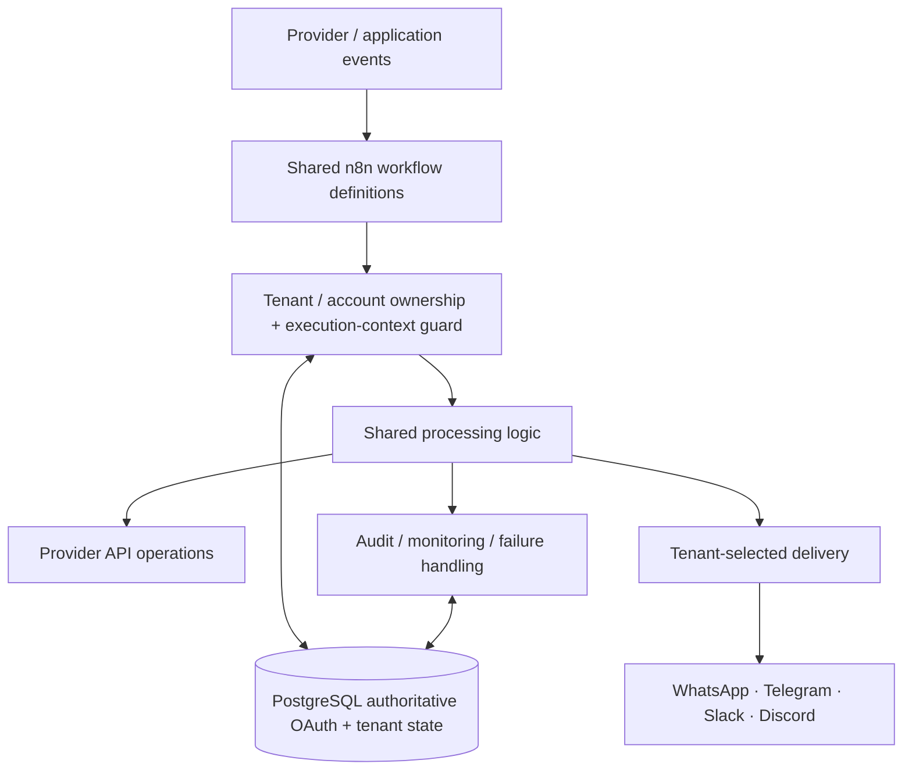

# MailIQ v4.1 — Architecture Diagram

[← v4.1 README](README.md) · [Version Index](../INDEX.md)

> **Status:** HISTORICAL UNIFIED ARCHITECTURE / IMPORTANT DECISION AUTHORITY.

## What changed

v4.1 rejects per-client workflow proliferation as the primary tenancy mechanism. The mature direction becomes **shared workflow definitions + tenant-scoped execution/context + PostgreSQL-backed authoritative provider state**.

## Why this matters

The archive ties this generation to an audit cycle with 14 findings. v4.1 is therefore the key transition architecture explaining several decisions later retained by v5.
