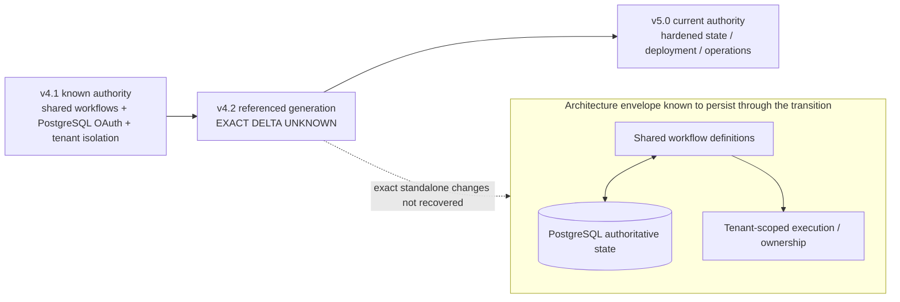

# MailIQ v4.2 — Known Architecture Envelope

[← v4.2 README](README.md) · [Version Index](../INDEX.md)

> **Status:** REFERENCED VERSION — STANDALONE ORIGINAL NOT LOCATED. This is **not** a reconstructed original v4.2 specification. It shows only the architecture envelope supported by adjacent v4.1/v5 evidence and marks the v4.2 delta as unknown.

## What this diagram does and does not say

It preserves v4.2's place in the real lineage without pretending the missing original was recovered. No workflow count, exact infrastructure change, SQL migration, node change or standalone decision is invented.
