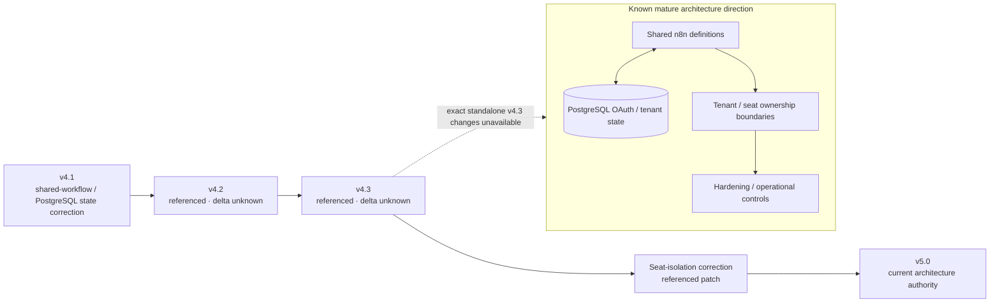

# MailIQ v4.3 — Known Architecture Envelope

[← v4.3 README](README.md) · [Version Index](../INDEX.md)

> **Status:** REFERENCED VERSION — STANDALONE ORIGINAL NOT LOCATED. The diagram records only evidence-supported continuity and the location of the unknown v4.3 delta.

## Evidence discipline

The lineage position is supported; the standalone v4.3 workflow inventory and exact changes are not. This page exists so the version still has a visual architecture record without fabricating the missing source.
