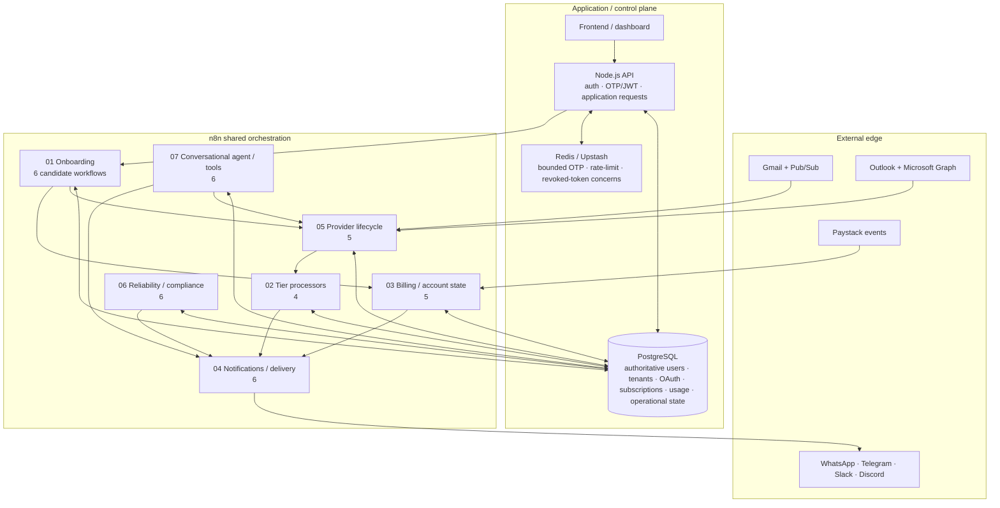

# MailIQ v5.0 — Current Architecture Diagram

[← v5.0 README](README.md) · [Version Index](../INDEX.md) · [38-workflow candidate bundle](../../workflows/current-candidate/README.md)

> **Status:** CURRENT ARCHITECTURE AUTHORITY. This is the v5 system model. It is not a claim that the whole system is currently deployed or that all 38 candidate exports have passed current configured-runtime verification.

## v5 architectural principles

- **Shared workflow definitions**, not per-client workflow proliferation, are the mature tenancy direction.
- PostgreSQL owns authoritative tenant/account/provider-token/subscription state.
- n8n orchestrates workflows and third-party webhook processing rather than becoming the sole application backend.
- external provider webhooks can terminate directly at n8n where appropriate.
- Railway remains the mature service-network direction; static/frontend direction can use Vercel.
- PgBouncer session pooling is preferred where prepared statements make transaction pooling unsafe for n8n.
- MinIO is not part of the current default architecture.
- reliability workflows—health, backup, alerts, data purge, history pruning and DLQ recovery—are part of the architecture, not afterthoughts.

## Current workflow visibility

The sanitized public candidate pool is grouped under [`../../workflows/current-candidate/`](../../workflows/current-candidate/README.md). Sanitized does **not** mean runtime-verified.
