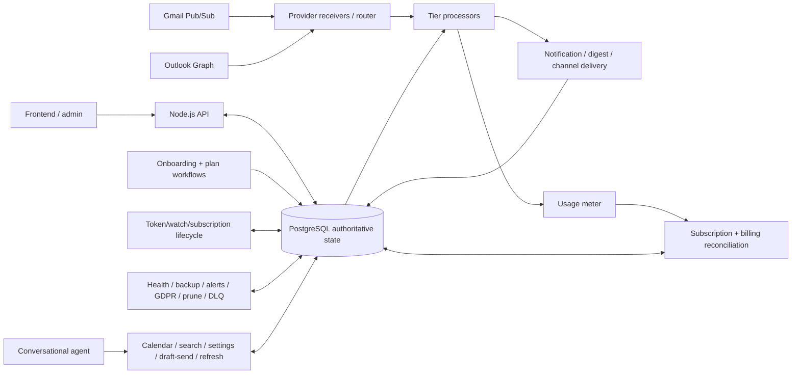

# MailIQ v5.0 — Architecture & Cooperating Workflow System

**Status:** CURRENT ARCHITECTURE AUTHORITY · workflow bundle under reconciliation/revalidation  
**Primary authority:** v5 Master Architecture  
**Current public claim:** offline/pre-production multi-version SaaS engineering system; not a live paying SaaS.

## System shape

MailIQ v5 is a **multi-workflow application architecture**. No single n8n workflow is the system. Application/API state, provider lifecycle, email ingestion, plan-specific processing, delivery, metering/billing, reliability operations and conversational tools cooperate through shared authoritative state.

## Recovered candidate pool

The later archive contains **38 workflow exports** grouped into:

1. onboarding/plan routing;
2. tier processors;
3. shared routing, billing and account-state workflows;
4. notification/delivery coordination;
5. provider lifecycle;
6. reliability/compliance/operations;
7. conversational agent and tool workflows.

See [`WORKFLOW_INDEX.md`](WORKFLOW_INDEX.md) for the full inventory.

## Current architectural decisions

- Node.js/API boundary remains responsible for application-facing auth/backend concerns.
- n8n is the orchestration/external-event layer, not the sole system of record.
- provider OAuth/token state belongs in PostgreSQL-backed authoritative state.
- shared workflow definitions + isolated tenant execution replace per-client workflow replication.
- external provider webhooks can terminate directly at n8n where appropriate.
- Railway remains the mature service-network direction; static/frontend direction moves toward Vercel.
- PgBouncer session pooling is preferred for n8n where prepared-statement behavior matters.
- MinIO is not retained as the current default storage/backup choice.
- reliability controls—pruning, error workflow, rate/edge controls, monitoring, migrations, backup/DLQ—are part of the architecture rather than optional polish.

## Current-candidate publication map

`workflows/current-candidate/` is intended to mirror the subsystem inventory. A file may only be placed there after sanitization and provenance checks. The repository currently exposes provider-lifecycle JSONs and will expand group-by-group as safe artifacts are mapped.

## Required workflow-level documentation

Every published current workflow should eventually have:

- workflow ID/name and subsystem;
- callers / trigger source;
- inputs;
- outputs;
- authoritative state read/writes;
- downstream dependencies/callees;
- retry/error behavior;
- tenant/ownership assumptions;
- sanitization note;
- verification date/status.

## Current evidence directories

- `../../evidence/current/demo/` — current demo or explicit placeholder only;
- `../../evidence/current/screenshots/` — current screenshots or explicit placeholder only;
- `../../assets/` — architecture/visual evidence.

Historical media must never be copied into these folders and relabelled current.

## Verification gate

A workflow becomes `CURRENT VERIFIED` only after source/generation mapping, sanitization, import/topology validation, data/state-contract review, branch/expression inspection, representative configured execution, and appropriate failure/retry/state-provenance checks.

## Known historical defect class

MailIQ previously exhibited identifier/state-reference mismatches where actions could succeed while authoritative account state was written incorrectly. v5 validation must explicitly test that successful external actions and persisted state references remain consistent before downstream activation/success is reported.