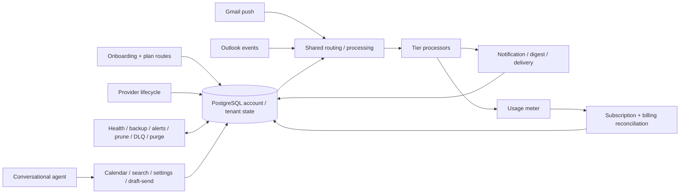

# MailIQ v5.0 — Candidate Workflow Index

> **Important:** this is an inventory of the recovered later-generation candidate pool. It is **not** a statement that all 38 exports are currently enabled, production-deployed or fully revalidated.

## 01 — Onboarding / plan routing

| Workflow | Responsibility | Public JSON status |
|---|---|---|
| Onboarding Router | route account onboarding into plan-specific path | publication/revalidation pending |
| Free Onboarding | provision Free-plan state/resources | pending |
| Basic Onboarding | provision Basic-plan state/resources | pending |
| Standard Onboarding | provision Standard-plan state/resources | pending |
| Premium Onboarding | provision Premium-plan state/resources | pending |
| Business Onboarding | provision Business-plan state/resources | pending |

## 02 — Tier processors

| Workflow | Responsibility | Public JSON status |
|---|---|---|
| Free Tier Processor | plan-specific email processing/routing | pending |
| Basic Tier Processor | plan-specific email processing/routing | pending |
| Standard Tier Processor | plan-specific email processing/routing | pending |
| Premium Tier Processor | plan-specific email processing/routing | pending |

## 03 — Shared routing, billing and account state

| ID | Workflow | Responsibility |
|---|---|---|
| SW-02 | Multi-Webhook Router | normalize/route shared webhook entrypoints |
| SW-03 | Subscription Lifecycle | subscription state changes |
| SW-04 | Billing Reconciliation | reconcile billing/account state |
| SW-06 | Usage Meter | record/aggregate usage |
| SW-19 | Settings API | workflow-facing settings operations |

## 04 — Notifications / delivery coordination

| ID | Workflow | Responsibility |
|---|---|---|
| SW-05 | Notification Engine | shared notification dispatch |
| SW-07 | Digest Dispatcher | digest scheduling/dispatch |
| SW-08 | Quiet Hours Flush | release deferred delivery after quiet hours |
| SW-08b | Telegram Chat ID Capture | capture Telegram delivery identity |
| SW-09 | Slack OAuth Callback | Slack authorization callback |
| SW-10 | Discord Bot Join Handler | Discord integration/join handling |

## 05 — Provider lifecycle

These are already the most visible current-candidate group in the public repository.

| ID | Workflow | Responsibility |
|---|---|---|
| SW-11 | Gmail PubSub Receiver | Gmail push-event ingestion |
| SW-12 | Outlook Graph Receiver | Outlook/Microsoft Graph event ingestion |
| SW-13 | Token Refresher | provider OAuth token refresh |
| SW-14 | Gmail Watch Renewer | renew Gmail watch lifecycle |
| SW-15 | Outlook Subscription Renewer | renew Microsoft Graph subscription lifecycle |

Public path: `workflows/current-candidate/05-provider-lifecycle/`.

## 06 — Reliability / compliance / operations

| ID | Workflow | Responsibility |
|---|---|---|
| SW-16 | Health Monitor | health/status monitoring |
| SW-17 | Database Backup | backup operation |
| SW-18 | Admin Alerts | operator/admin alerting |
| SW-21 | Data Purge / GDPR | data purge/compliance operation |
| SW-22 | History Pruner | retention/history pruning |
| SW-23 | DLQ Reprocessor | dead-letter recovery/reprocessing |

## 07 — Conversational agent and tool workflows

| ID | Workflow | Responsibility |
|---|---|---|
| SW-20 | Conversational Agent | conversational orchestration |
| TW-01 | Calendar | calendar tool operation |
| TW-02 | Email Search | email-search tool operation |
| TW-03 | Settings | settings tool operation |
| TW-04 | Draft / Send | email draft/send operation |
| TW-05 | Token Refresh Handler | tool-facing token refresh handling |

## Count reconciliation

The later candidate pool totals **38 exports** when onboarding, tier-processing, shared/system and tool workflows are counted together. This count is intentionally kept separate from earlier 35/36-workflow design/build generations.

## How the workflows cooperate

The database/application state boundary is what allows these workflows to cooperate without treating one n8n execution as the entire system of record.

## Publication rule

When sanitized JSON is published, place it under the matching `workflows/current-candidate/<group>/` directory and add:

- workflow-level README or manifest entry;
- input/output/state contract;
- dependencies/callers/callees;
- known failure behavior;
- verification date/result;
- sanitization note.

Until that exists, the workflow remains **documented candidate evidence**, not a verified public runtime artifact.